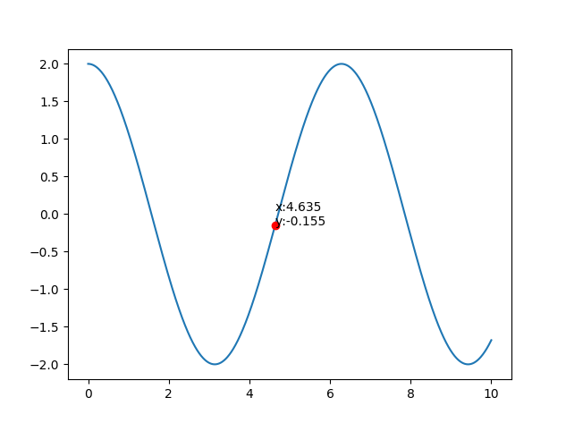
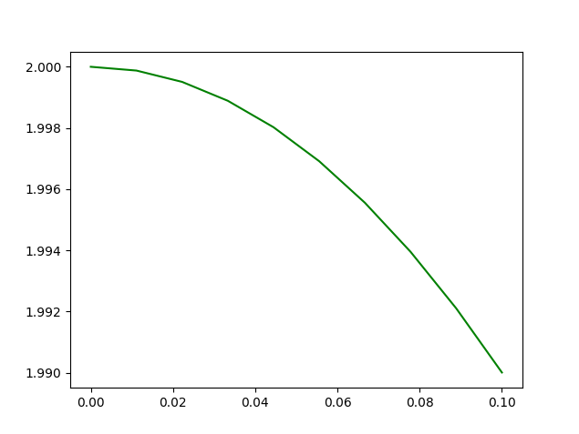
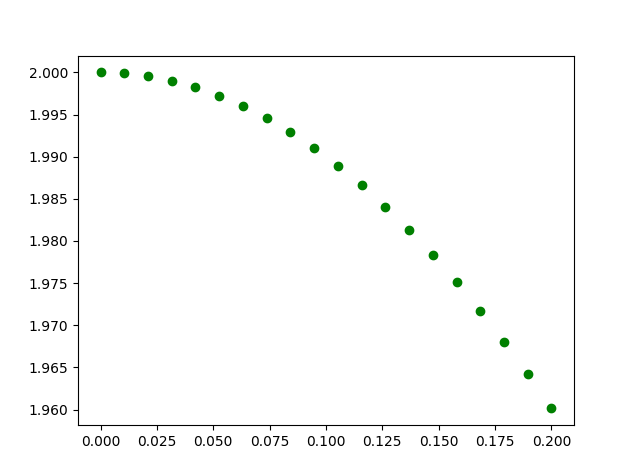
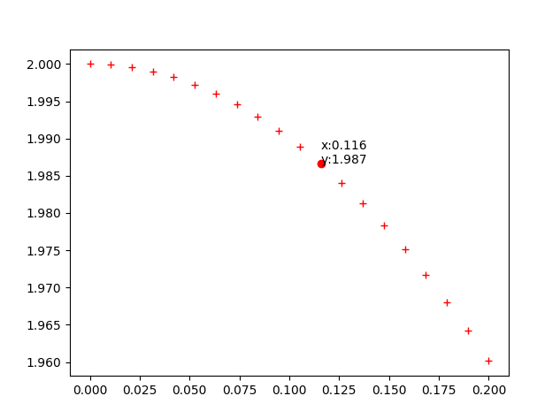

# Plot Inspector

A matplotlib tool to easily show a 2D nparray on matplotlib, and inspect closest elements from click

## Requirements
- Python 2 or 3
- numpy
- matplotlib

~~~
pip install numpy matplotlib
~~~

## How to use
Test it as:
~~~
python plot_inspector.py
~~~
Or provide your own data:
~~~python
from plot_inspector import Inspector
import numpy as np
step=0.01
nb=1000

X=np.linspace(0,nb*step,nb)
Y=2*np.cos(X)

Inspector(X,Y)
# Inspector(X,Y, precision=3, displayOptions="g")
# Inspector(X,Y, precision=3, displayOptions="go")
# Inspector(X,Y, precision=3, displayOptions="r+")
~~~

You can use it in a Thread or a Process, to avoid waiting for it to close,     or avoid to interfere with other pyplot:
~~~python
from multiprocessing import Process
import time

process = Process(target=lambda : Inspector(X,Y))
process.start()
time.sleep(4)
process.terminate()
~~~

Display options are the propagated to pyplot

- No display options:  

- "g":  

- "go":  

- "r+":  

## WIP
- Callback from user
- Multiples Input format : for now it's only X series and Y series, but a [(x,y),(x,y),(x,y)] could be handy
